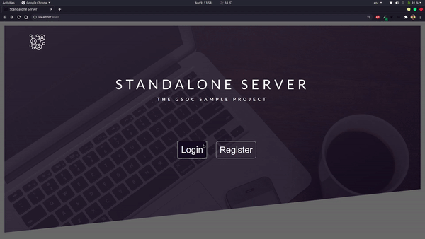
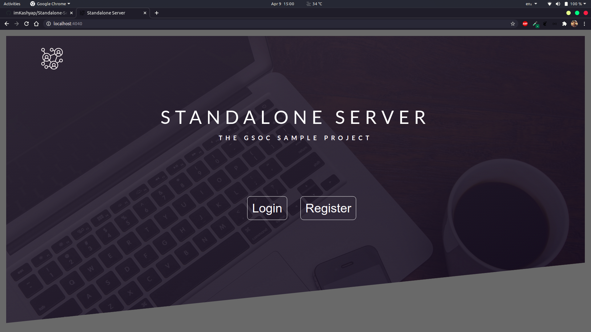
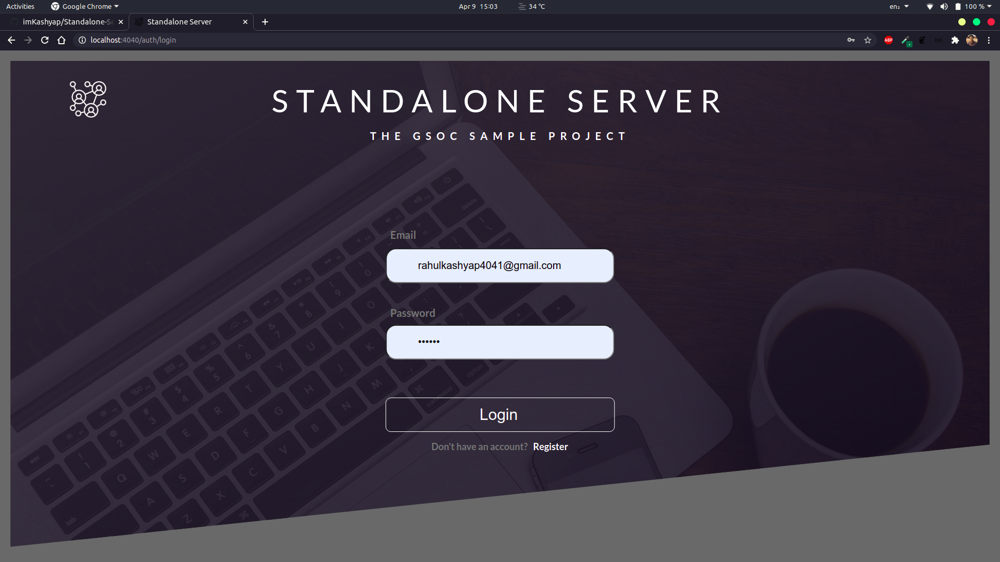
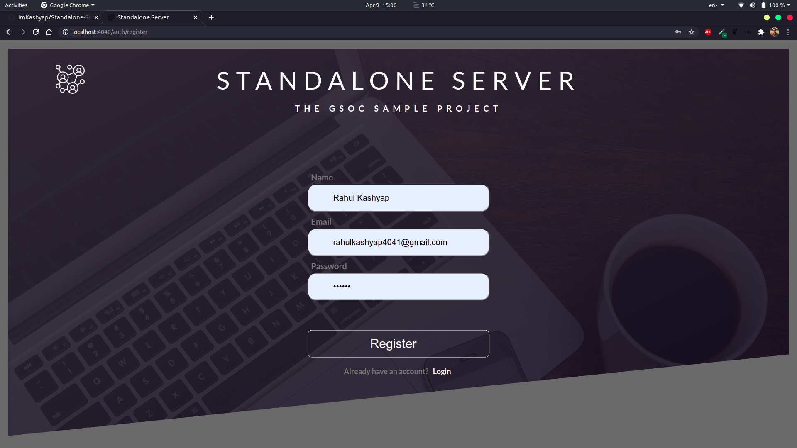
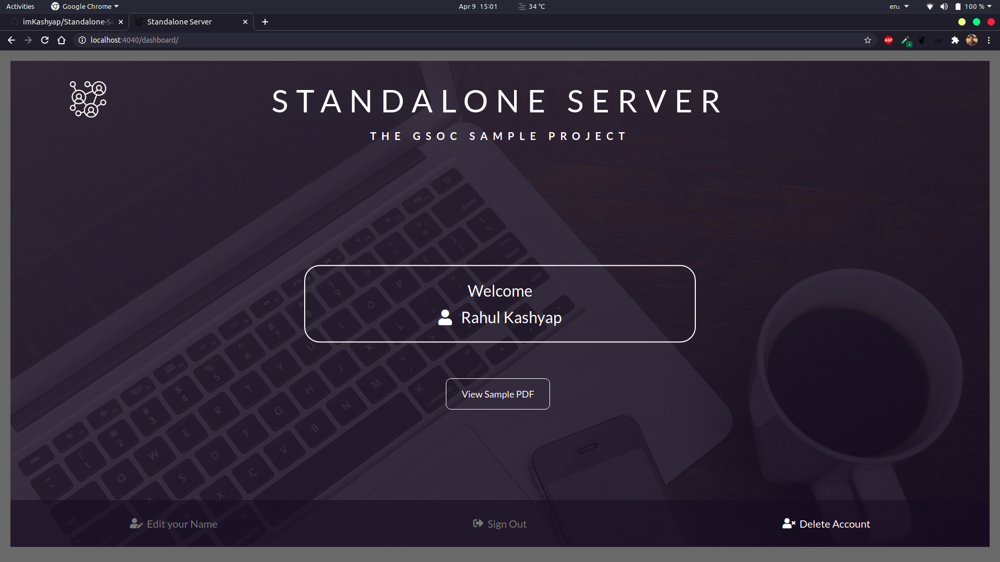

# Standalone-Server

[](https://github.com/ravgeetdhillon/dart_shelf_server_sample/actions/workflows/ci.yml)
[](https://opensource.org/licenses/MIT)
[](http://ansicolortags.readthedocs.io/?badge=latest)

- Standalone Server is a web server built using [Shelf](https://pub.dev/packages/shelf) in dart.
- A sample project with an entrypoint in `bin/`, library code in `lib/`,  client side code in `public/`, and example unit test in `test/`.
- The server serves some static HTML files (including CSS ) & a PDF file. I have implemented  user authentication using JWT tokens. Only once the user gets authenticated, He/She can view the PDF or Edit Name.




***

## Table of Contents
- [Standalone-Server](#standalone-server)
  - [Table of Contents](#table-of-contents)
  - [Features](#features)
  - [Screenshots](#screenshots)
  - [Code Structure](#code-structure)
  - [API Docs](#api-docs)
  - [Getting Started](#getting-started)
  - [License](#license)

***

## Features
Following features have been implemented:

- ✅ Serve REST requests (GET, POST, PATCH, DELETE)
- ✅ Serve static files from the server to authenticated users only
- ✅ Render HTML templates
- ✅ Convert Dart to JS for use client-side using dart2js compiler
- ✅ Authenticate users using JWT Token
- ✅ Local JSON Database under `database/users.json` 

***

## Screenshots
|Screen Name | Screenshots |
|---|--|
|Landing Page||
|Login Page||
|Register Page||
|Dashboard Page||

***

## Code Structure

```
standalone_server
 ┃
 ┣ bin (contains main server.dart file )
 ┃
 ┣ database (contains a user.json file storing users list as  local JSON storage)
 ┃
 ┣ lib
 ┃ ┣ interops (contains dart codes for Javascript interoperability)
 ┃ ┣ src
 ┃ ┃ ┣ apis
 ┃ ┃ ┃ ┗ validators (validator for validating input fields like name, email & password)
 ┃ ┃ ┣ configs
 ┃ ┃ ┃ ┣ routes.dart (all the routes mounted)
 ┃ ┃ ┃ ┗ utils.dart (functions commonly used are mentioned here)
 ┃ ┃ ┗ models (contains user model)
 ┃ ┗ server.dart (exports the package to bin/server.dart)
 ┃
 ┣ public (contains client side code like css, html & assets)
 ┃ ┗ assets
 ┃
 ┣ resources (contains screenshots & demo video)
 ┃
 ┗test (contains test.dart file)
```
***

## API Docs


| Routes                |REST request| Description                                    | Requirements        |
| --------------------- | -----------| ---------------------------------------------  | --------------------|
|  `/`                  | GET        | serves landing.html page                       |                     | 
|  `/auth/register`     | GET        | serves register.html page                      |                     |
|  `/auth/register`     | POST       | registers the user and returns a JWT token     | needs name, email & password as body |
|  `/auth/login`        | GET        | serves login.html page                         |                     |
|  `/auth/login`        | POST       | logs in the user and returns a JWT token       | needs email & password as body |
|  `/assets/<file.*>`  | GET        | serves static files under `public/assets/`     |                      |
|  `/auth/logout`       | POST       | logs out the user                              | needs Bearer token as authorization header|
|  `/user/`             | GET        | returns logged in user info in JSON            | needs Bearer token as authorization header|
|  `/user/`             | PATCH      | edits the name of logged in user               | needs Bearer token as authorization header & new name as body|
|  `/user/`             | DELETE     | deletes logged in user account                 | needs Bearer token as authorization header|
|  `/dashboard`         | GET        | serves dashboard.html page                      |                     |
|  `/file/<userid>/<file.*>` | GET  | serves files from disk to authenticated users only (Here, sample.pdf)|                     |    

***

## Getting Started

Perform the following operations to set up the project.

```bash
git clone git@github.com:imKashyap/Standalone-Server.git
pub get
nodemon
```

> Nodemon is an NPM package used to watch for the changes in source code and restart the shelf server automatically. You can install it by doing `npm i -g nodemon`. But make sure node is installed in your machine.

Visit [http://localhost:4040](http://localhost:4040) and make sure you see the following screen:


## License
 [MIT](https://github.com/imKashyap/Standalone-Server/blob/main/LICENSE)
