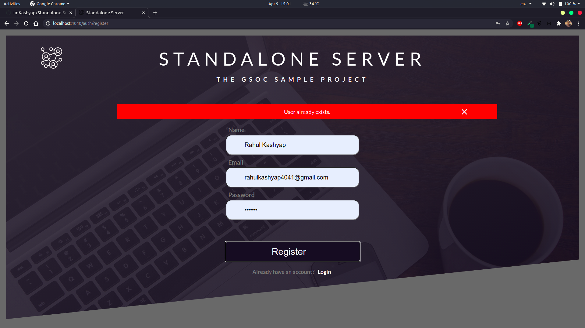

# Standalone-Server

Standalone Server is a web server built using [Shelf](https://pub.dev/packages/shelf) in dart.

***

## Table of Contents
- [Features](#features)
- [Screenshots](#screenshots)
- [Code Structure](#code-structure)
- [Api Docs](#api-docs)
- [Getting Started](#getting-started)
- [License](#license)

***

## Features
A web server built using [Shelf](https://pub.dev/packages/shelf). Following features have been implemented:

- [x] Serve a REST API in JSON
- [x] Serve static files from the server
- [x] Render HTML
- [x] Compile Dart Code to Javascript

***

## Screenshots
|Screen Name | Screenshots |
|---|--|
|Landing Page||
|Login Page||
|Register Page||
|Dashboard Page||
|When error in auth credentials||

***

## Code Structure
## API Docs

| Routes                | Description                                 |
| --------------------- | ------------------------------------------- |
| **GET** `/posts`      | Get all the posts                           |
| **GET** `/posts/{id}` | Get a single post identified by its id      |
| **GET** `/files`      | Get a list of files available on the server 
## Getting Started

## License
 [MIT]()

